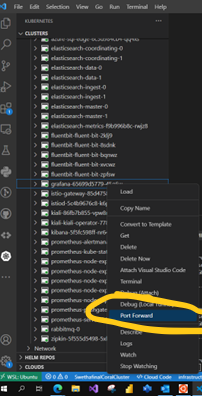

# NetObsStatsGenerator App Seed

This is an application seed that is part of the general Network Observability solution consisting of containerized .NET application development with cloud-native capabilities.

Follow this link for a more generic version of a [.NET Project App Seed](https://github.com/microsoft/coral-seed-dotnet-core-webapi)

Backlog in Coral project: [#170 Create new coral-seed-dotnet-core-webapi on .NET Core 6.0](https://github.com/microsoft/coral/issues/170)

## Getting Started

To get started with Coral, see the [platform setup instructions](https://github.com/microsoft/coral/blob/main/docs/platform-setup.md) in the main [Coral](https://github.com/microsoft/coral) repo.

## Baseline Features

The application seed contains the following cloud-native capabilities:

1. Performance metrics
2. Init container
3. Data Storage
4. Metadata for observability

## Goals

The goal for the NetObsStatsGen container service is to create the  `PacketsView` SQL database view and the `Intervals` sql database table in order to support the SQL queries necessary to visualize Network Observability Statistics in Grafana.

## Network Observability Features

NetObsStatsGenerator consumes the `EventMetadata` RabbitMq message which contains the `julianDay` field and uses this `julianDay` to extract the data from `PacketIndices` and `PcapMetaData` table to create the view `PacketsView` in the sql database.

Below are snippets of the database records created.


### Packets View

The packets view is used for multiple statistics in the Grafana charts.
One thing to note is that IPv6 addresses are ignored in the view. If you want to include the IPv6 entries then you will have to have a mechanism to support sorting on those ips if not, the Grafana charts will break. 

One option for supporting IPV6 entries is to convert both the IPv4 and IPv6 to its decimal equivalent and using that number to sort. But with this approach if you're planing to store the decimal number, for IPv6 it has to support 128 bit number. So the appropriate data type must be used. 

## Application Development

The project contains a [sample .env](./.env.example) file that must be configured and made into a .env file before dotnet commands can be issued.
Once the file has been configured, there are three ways it can be loaded.

- The most simple way is just by opening a new bash terminal. The .env file will be injected into the environment automatically.
- The following command can be issued to load the .env `source .env`
- If the above two doesn't work, the following command can be issued if the .env file has comments ``export `cat .env | awk '!/^[[:blank:]]*$/' | grep -o '^[^#]*'` && bash``. If comments are removed from the .env file then this command will work ``export `cat .env` && bash``

After the .env is loaded the following commands will work.

- In src/App, run `dotnet build` to build your app
- In src/App, run `dotnet run` to run your app
- In test/App.Test, run `dotnet test` to run unit tests

## Environment Configuration

The following variables are required to allow  successful pipeline and local builds. Select a platform to view.

### Environment variables necessary for local development or injection through app.yaml

NAME | REQUIRED (Y/N) | PURPOSE / EXAMPLE VALUES
--- | --- | ---
EVENTDATA_PROCESS_QUEUE | Y | Queue name to consume messages from
DB_CONNECTION_STRING | Y | SQL server database connection string: `SERVER=servicename.namespace;TRUSTSERVERCERTIFICATE=true;UID=sa;PASSWORD=xxx;` [Configured via Control Plane from Platform team](https://github.com/crew-athena-org/network-observability-control-plane-seed/tree/main/templates/istio-service#configuring-secrets)
RABBITMQ_HOSTNAME | Y | RabbitMQ hostname: `name.namespace.svc.cluster.local`
RABBITMQ_USERNAME | Y | RabbitMQ username to use for connection
RABBITMQ_PASSWORD | Y | RabbitMQ password [Configured via Control Plane from Platform team](https://github.com/crew-athena-org/network-observability-control-plane-seed/tree/main/templates/istio-service#configuring-secrets)
RABBITMQ_PORT | N | RabbitMQ host port(defaults to 5672)
ELASTICSEARCH_URI| N | When provided logs will be pushed to an elasticsearch instance

<details>
  <summary>GitHub Variables</summary>

### In local `.env` file

NAME | REQUIRED (Y/N) | PURPOSE / EXAMPLE VALUES
--- | --- | ---
GITHUB_PACKAGE_REGISTRY_USERNAME | Y | username to authenticate to github / `username`. This token can be obtained by going to `Profile` -> `Settings` -> `Developer Settings` -> `Personal Access Tokens(PAT)`. It must contain at least `repo`, `workflow`, and `write:packages` permissions.
GITHUB_PACKAGE_REGISTRY_PASSWORD | Y | password to authenticate to github / `Dxxxxxxxxxxxxx`. This token can be obtained by going to `Profile` -> `Settings` -> `Developer Settings` -> `Personal Access Tokens(PAT)`. It must contain at least `repo`, `workflow`, and `write:packages` permissions.
NUGET_PLATFORM_URL | Y | platform URL to allow required common package imports / `https://nuget.pkg.github.com/<your-org-name>/index.json`
NUGET_SOURCE_URL | Y | nuget source URL to allow required nuget owned package imports / `https://api.nuget.org/v3/index.json`

See [.env.example](.env.example) for more info

### In repository's CI/CD setting variables

Secrets can be created by following the below steps:

- [GitHub Manual Way](https://docs.github.com/en/actions/security-guides/encrypted-secrets#creating-encrypted-secrets-for-a-repository) Or
- By using [gh secret CLI](https://cli.github.com/manual/gh_secret_set) and `env` file as below
  - Installation details for [gh secret](https://github.com/cli/cli/blob/trunk/docs/install_linux.md#debian-ubuntu-linux-raspberry-pi-os-apt)
  - Create a .envgh in your local with all the env variables. Sample can be found [here](./.envgh.example)
  - Run the command to generate the secrets for your repository `gh secret set -f .envgh -R <githubrepourl>`

NAME | REQUIRED (Y/N) | PURPOSE / EXAMPLE VALUES
--- | --- | ---
CONTAINER_REGISTRY_URL | Y | endpoint for container registry for pipeline to push image to / `xxxx.azurecr.com`
CONTAINER_REGISTRY_USER | Y | username to authenticate to the destination container registry / `registry_user`
CONTAINER_REGISTRY_ACCESS_TOKEN | Y | password to authenticate to the destination container registry / `xxxxxxxxxxxxxxxxxxxx`
PACKAGE_REGISTRY_USERNAME | Y | username to authenticate to github / `username`. This token can be obtained by going to `Profile` -> `Settings` -> `Developer Settings` -> `Personal Access Tokens(PAT)`. It must contain at least `repo`, `workflow`, and `write:packages` permissions.
PACKAGE_REGISTRY_PASSWORD | Y | password to authenticate to github / `ghp_xxxxxxxxxxxxx`. This token can be obtained by going to `Profile` -> `Settings` -> `Developer Settings` -> `Personal Access Tokens(PAT)`. It must contain at least `repo`, `workflow`, and `write:packages` permissions.
NUGET_PLATFORM_URL | Y | platform URL to allow required common package imports / `https://<your_repo_domain>/api/v4/projects/<common_package_group_id>/nuget/index.json`
NUGET_SOURCE_URL | Y | nuget source URL to allow required nuget owned package imports / `https://api.nuget.org/v3/index.json`

### In local Dockerfile

Make sure the dockerfile contains the following ARGs:

```bash
ARG GITHUB_PACKAGE_REGISTRY_USERNAME
ARG GITHUB_PACKAGE_REGISTRY_PASSWORD
ARG NUGET_SOURCE_URL
ARG NUGET_PLATFORM_URL
```

</details>

<details>
  <summary>Gitlab variables</summary>
In repo's `nuget.config` file, update the file to point to use gitlab variables, such as

```bash
<?xml version="1.0" encoding="utf-8"?>
<configuration>
  <packageSources>
     <clear />
  <add key="nuget" value="%NUGET_SOURCE_URL%" />
  <add key="gitlab" value="%NUGET_PLATFORM_URL%" />
  </packageSources>
  <packageSourceCredentials>
     <gitlab>
         <add key="Username" value="%GITLAB_PACKAGE_REGISTRY_USERNAME%" />
         <add key="ClearTextPassword" value="%GITLAB_PACKAGE_REGISTRY_PASSWORD%" />
     </gitlab>
  </packageSourceCredentials>
</configuration>
```

  NAME | REQUIRED (Y/N) | PURPOSE / EXAMPLE VALUES
--- | --- | ---
GITLAB_PACKAGE_REGISTRY_USERNAME | Y | username to authenticate to gitlab / `First.Last`. Unlike the variable in pipeline, this value must be the exact unique name of the deploy token. This token can be obtained by going to `Repo` -> `Settings` -> `Repository` -> `Deploy Tokens`.
GITLAB_PACKAGE_REGISTRY_PASSWORD | Y | password to authenticate to gitlab / `Dxxxxxxxxxxxxx`. This token can be obtained by going to `Repo` -> `Settings` -> `Repository` -> `Deploy Tokens`.
NUGET_PLATFORM_URL | Y | platform URL to allow required common package imports / `https://<your_repo_domain>/api/v4/projects/<common_package_group_id>/nuget/index.json`
NUGET_SOURCE_URL | Y | nuget source URL to allow required nuget owned package imports / `https://api.nuget.org/v3/index.json`

See [.env.example](.env.example) for more info

### In repository's CI/CD setting variables

Secrets can be created by following the below steps:

- [GitLab Manual Way](https://docs.gitlab.com/ee/ci/variables/#for-a-project) Or
- By using a [GitLab Rest API](https://docs.gitlab.com/ee/api/project_level_variables.html#create-a-variable)

NAME | REQUIRED (Y/N) | PURPOSE / EXAMPLE VALUES
--- | --- | ---
CONTAINER_REGISTRY_URL | Y | endpoint for container registry for pipeline to push image to / `xxxx.azurecr.com`
CONTAINER_REGISTRY_USER | Y | username to authenticate to the destination container registry / `registry_user`
CONTAINER_REGISTRY_ACCESS_TOKEN | Y | password to authenticate to the destination container registry / `xxxxxxxxxxxxxxxxxxxx`
NUGET_PLATFORM_URL | Y | platform URL to allow required common package imports / `https://<your_repo_domain>/api/v4/projects/<common_package_group_id>/nuget/index.json`
NUGET_SOURCE_URL | Y | nuget source URL to allow required nuget owned package imports / `https://api.nuget.org/v3/index.json`

### In local Dockerfile

Make sure the dockerfile contains the following ARGs:

```bash
ARG GITLAB_PACKAGE_REGISTRY_USERNAME
ARG GITLAB_PACKAGE_REGISTRY_PASSWORD
ARG NUGET_SOURCE_URL
ARG NUGET_PLATFORM_URL
```

</details>


### Workflow Pipelines for GitHub

Docker file is created under root /Dockerfile which does a build and push to the configured registry container.
For a sucessfull pipeline run, Once the dotnet repo is created add the below CI-CD pipeline variables for the Repository

```bash
CONTAINER_REGISTRY_URL : conatiner-registry-url
CONTAINER_REGISTRY_ACCESS_TOKEN : conatiner-registry-accesstoken
CONTAINER_REGISTRY_USER : conatiner-registry-user
PACKAGE_REGISTRY_USERNAME : Github-package-registry-user-where-commonisstored
PACKAGE_REGISTRY_PASSWORD: Github-package-registry-password
NUGET_PLATFORM_URL: Nuget-platform-github-url
NUGET_SOURCE_URL: Nuget-common-package-source-url
```

### Workflow Piplines For GitLab

- Create the necessary Common library packages using repo <https://code.afcmade.com/devteam/cse/cse-efr-coral/templates/NetworkObservabilityUtilities>
- Create a GitLab Pipline Runner for the group if not already available. Document to create a runner with the runner tag can be found at network-observability-control-plane-seed/docs/design-decisions/gitlab-runner.md
- Clone the App seed repo into GitLab
- Create the below CICD variables

```bash
CONTAINER_REGISTRY_URL : conatiner-registry-url
CONTAINER_REGISTRY_ACCESS_TOKEN : conatiner-registry-accesstoken
CONTAINER_REGISTRY_USER : conatiner-registry-user
```

- Update the nuget.config files with the gitlab specific common library path , similar to below

```bash
<add key="gitlab" value="https://gitlab.com/api/v4/projects/---/index.json" />
<gitlab>
  <add key="Username" value="%GITLAB_PACKAGE_REGISTRY_USERNAME%" />
  <add key="ClearTextPassword" value="%GITLAB_PACKAGE_REGISTRY_PASSWORD%" />
</gitlab>
```

- Update the docker file to use these ARG variables

``` bash
ARG GITLAB_PACKAGE_REGISTRY_USERNAME
ARG GITLAB_PACKAGE_REGISTRY_PASSWORD
```

## Grafana For Network Observability Visualizations

Note: Once the NetObsStatsGenerator is successfully deployed, the NetObsStatsGenerator app team should contact the control plane platform team to get the Network Observability Dashboards configured.

### Changes needed to configure the network-observability dashboard

Network Observability Dashboard can be found [here](./deployment/grafana/network-observability-dashboard.json)

The above json file contains the required Grafana dashboard configuration that the control plane platform team must apply to the control plane seed by copying the contents of the file to the network observability control plane instance network-observability-control-plane-seed/manifests/grafana/patches folder of the deploying the NetStatsGenerator application service on the control plane.

More specific details on how to configure the app specific dashboard in control plane can be found at network-observability-control-plane-seed/docs/design-decisions/service-specific-configuration.md

Once the dashboards are configured by the platform team, Grafana can be used for visualizations. NetObsStatsGenerator creates all the necessary data required for the Network Observability visualizations.

Login to the Grafana by kubernetes port-forward connection, the dashboard can be accessed at localhost with the port:3000. Username and password can be found under kubernetes/namespace/Configuration/Secrets/grafana/password



Below are some snippets of the network observability dashboad


### Container Development

Your Codespace has a preconfigured running cluster so that you can validate how your application will behave when deployed

- From `Tasks: Run Task` (press `Ctrl+Shift+P`), select `Run in local cluster`. Your app will load in a new browser tab.
- To reset the local cluster for any reason, you can use the `Reset local cluster` task

Your Codespace also has a local portal that exposes a number of services that will also be present when your app is deployed

- Using `Tasks: Run Task`, select `Launch Platform Portal in New Tab`
- The application increments a metric named `hits` each time the "Hello, World!" path is used. From the portal, use [Prometheus](https://prometheus.io/) to query app metrics
- [Grafana](https://grafana.com/) is also available for visualization. The instance is local to your Codespace with the following settings:
  - A `Sample Dashboard` to see the `api_hits_total` counter (Navigate to the 'General' folder to see the link)
- [Fluentbit](https://fluentbit.io/) is configured to scrape the application and Kubernetes logs and can be accessed from the portal. A Fluentbit filter is applied to the application logs to exclude log messages that contain 200 responses at the `/healthcheck` and `/metrics` endpoints. [Serilog](https://serilog.net/) can be configured to your needs. For more information on how to configure the logger, see the [Serilog wiki](https://github.com/serilog/serilog/wiki/Configuration-Basics).

> You can also view the list of [forwarded ports](https://docs.github.com/en/codespaces/developing-in-codespaces/forwarding-ports-in-your-codespace) available to your Codespace in the `PORTS` tab in the Integrated Terminal

### Configuring a different Container Registry

This environment comes with github actions to build and push the application containers to the GitHub container registry.

If you wish, you can configure the repo to use the container registry of your choice by [creating the following secrets in the repository](https://docs.github.com/en/actions/reference/encrypted-secrets#creating-encrypted-secrets-for-a-repository):

- CONTAINER_REGISTRY_URL
- CONTAINER_REGISTRY_USER
- CONTAINER_REGISTRY_ACCESS_TOKEN

These values can be obtained from your specific container registry provider.

> **Note**
>
> To return to the default, simply remove the secrets from the repository.

## Contributing

This project welcomes contributions and suggestions.  Most contributions require you to agree to a
Contributor License Agreement (CLA) declaring that you have the right to, and actually do, grant us
the rights to use your contribution. For details, visit <https://cla.opensource.microsoft.com>.

When you submit a pull request, a CLA bot will automatically determine whether you need to provide
a CLA and decorate the PR appropriately (e.g., status check, comment). Simply follow the instructions
provided by the bot. You will only need to do this once across all repos using our CLA.

This project has adopted the [Microsoft Open Source Code of Conduct](https://opensource.microsoft.com/codeofconduct/).
For more information see the [Code of Conduct FAQ](https://opensource.microsoft.com/codeofconduct/faq/) or
contact [opencode@microsoft.com](mailto:opencode@microsoft.com) with any additional questions or comments.

## Trademarks

This project may contain trademarks or logos for projects, products, or services. Authorized use of Microsoft
trademarks or logos is subject to and must follow
[Microsoft's Trademark & Brand Guidelines](https://www.microsoft.com/en-us/legal/intellectualproperty/trademarks/usage/general).
Use of Microsoft trademarks or logos in modified versions of this project must not cause confusion or imply Microsoft sponsorship.
Any use of third-party trademarks or logos are subject to those third-party's policies.
